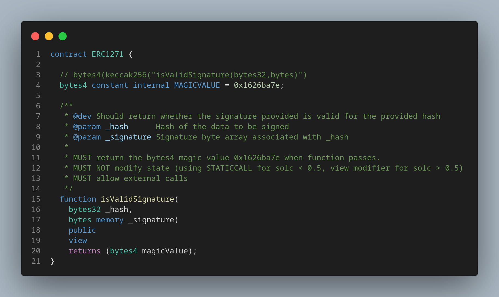

# ERC-1271: Standard Signature Validation Method for Contracts
[https://eips.ethereum.org/EIPS/eip-1271](https://eips.ethereum.org/EIPS/eip-1271)

1. Contracts can't sign messages like EOA's, this provides a way to verify if signatures sent on behalf of contracts are valid.
2. Must implement `isValidSignature` function

