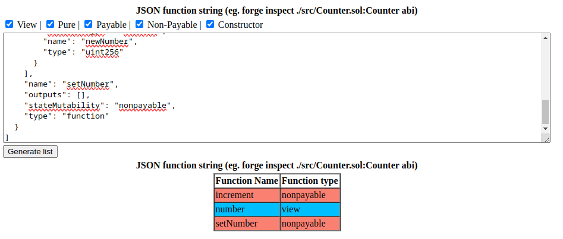

# ABI PARSER HTML FILE
You can use this file locally to parse an abi copied from a block explorer or the output of the forge ins[ect copmmand `eg. forge inspect ./src/Counter.sol:Counter abi`

This enables you to have a quick filterable view of the functions in a contract.

DISCLAIMER: I do not warrant this code a bug free and or fit for purpose. do not use in a production environment.
