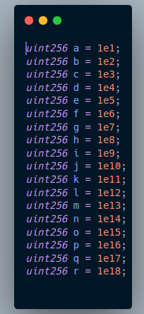
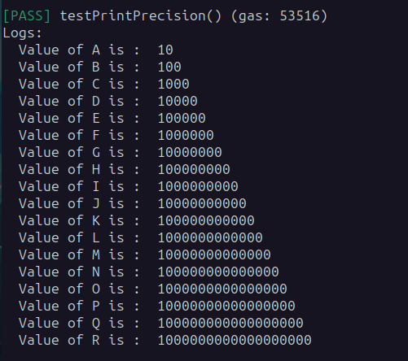
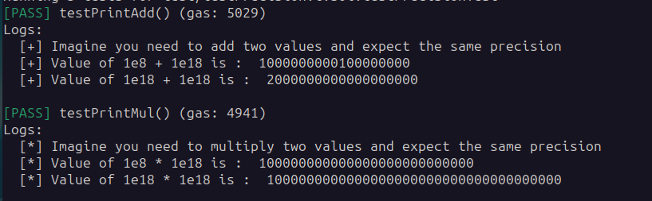

## Precision
I created these files and images so I could test what the exact impact of precision in solidity contracts
you can test further in the file called `testPrecision.t.sol` in this repo.

## Declare Values

## Print values

## Tests output

## Disclaimer : Do not use this code in production systems.
