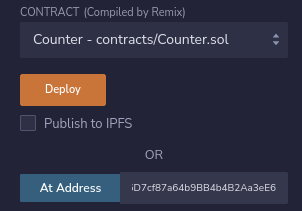

This example allows you to test the create2 functionality with Foundry's ANVIL.
1. Start Anvil `anvil`.
2. Open Remix and deploy the Create2.sol contract.
3. Call the `createFirst()` function. This will deploy an instance of the Counter contract.
4. Call `_counteraddress` public view function to get the deployed Counter addess.
5. In Remix don't deploy an instance of the Counter contract but use the functionality to interact with a Counter contract at and address 
6. Call the `number()` view function of the Counter contract it should show 40_000
7. Call the `bye()` selfdestruct function this will selfdestruct the Counter contract.
8. Now you can call the functions of the Counter contract but you will see no values as its been selfdestructed.
9. Do not remove it from Remix
10. Now call the `createSecond()` function in the Create2 contract.
11. You will see you are now able to get values in the Counter contract again without needing to change the address.
